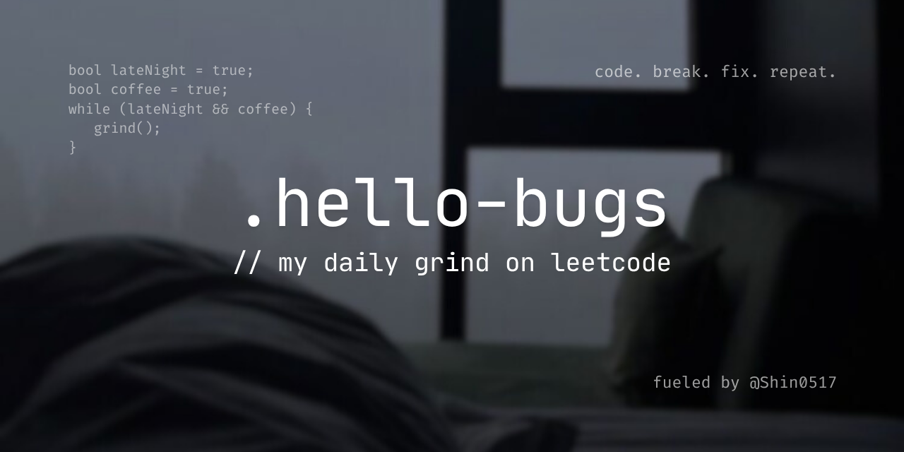

<h1 align="center">
  🧠 A LeetCode Journey – brute force ➡️ brain force
</h1>

  

  Welcome to my late-night `debug()` sessions. This repo documents my quest to become a better problem solver. 
  I’m solving problems, writing readable code, and committing like a responsible adult👤

---

Learning is better when...
- Progress is **tracked**   
- Solutions can be **reused**
###### Also when GitHub green squares lights up...💦

## 🛠️ What's Inside

-  LeetCode problems daily 
-  My solutions 
-  Folder names are clean and commit messages are *semi-readable* 
-  `README.md` files with explanations and optimizing sugguestions 

## 🫀 My Leetcode Stats

## 🙏 Credits & Inspiration

This idea and structure is inspired by [@1chooo](https://github.com/1chooo), 
whose clean repo setup and approach gave me the nudge to start organizing my own work more seriously.

## 🪪 License

MIT License
If you borrow a good chunk of it, a shoutout would be cool. We're all trying to level up together.